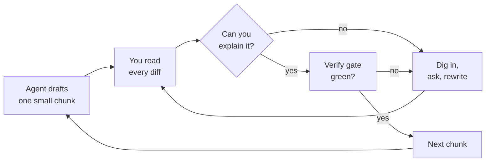
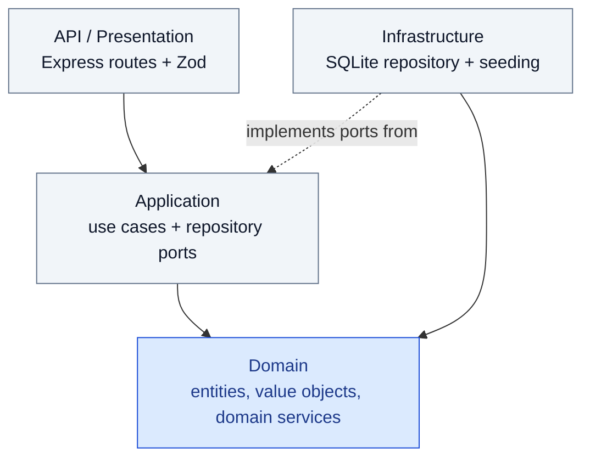
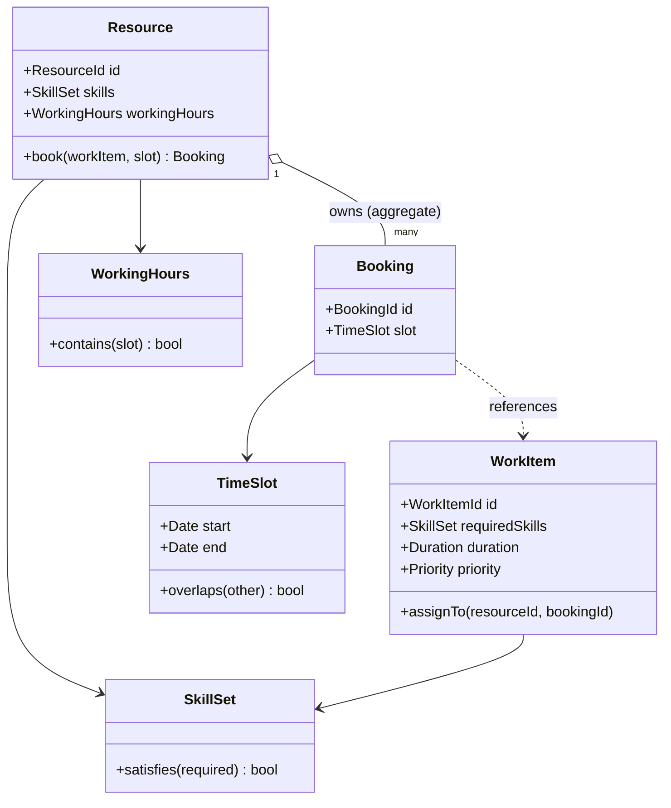
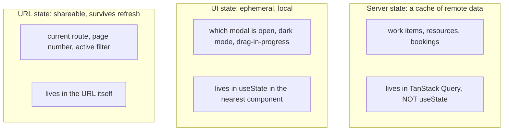
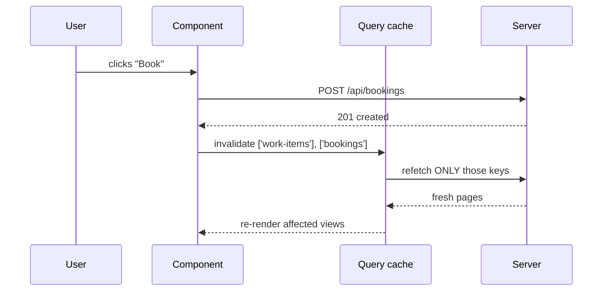
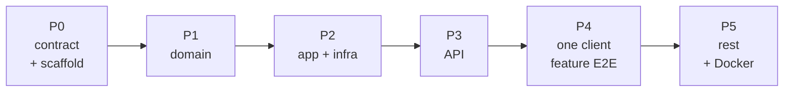

# The rebuild lesson: relearning the front end by redoing it right

> Companion to the chronicle (S1 to S10). Read it after S7 (the autopsy) and the rebuild trio:
> S8 (the brief, method, and plan), S9 (the server), S10 (the client). The slides are the map; this is the
> territory: it names every gap between the POC you shipped and the clean version you are about to build,
> translates each one into the ASP.NET vocabulary you already think in, and lays out the rebuild as small,
> ordered, reviewable chunks.

## Why this lesson exists

This is a **training ground, not the destination.** `simple-scheduling-app` is throwaway. The real goal is
that you are about to start building UIs for real, and you want the fundamentals solid before you do, not
half-absorbed from a weekend of fast, agent-driven vibe coding.

The first pass was **learn by doing**: ship a rough thing fast, with AI, with only a loose grip on the code
underneath, to see the whole shape of a front end. That was the right first move. It generated information a
spec never could. But it left you with concepts you brushed over rather than owning: the React state model,
where data should live, why the server owns the truth, what "clean architecture" actually buys you.

This rebuild is **relearn by redoing**: build the same app again, deliberately, this time understanding
every decision because you felt the cost of getting it wrong the first time.

## How to use this lesson (the method matters)

S8 makes this point in the deck; here is the long version. For learning, a blind hand-off to an agent is the
enemy: you would get an app back and understand none of it. Use this method instead:

- **AI assists, you review.** Let an agent draft a chunk, but read every diff with your own eyes before you accept it. If you cannot explain a line, you have not learned it yet. Stop and dig in.
- **Small, scoped chunks.** Each step below is sized so a single diff is readable in one sitting. A chunk you cannot review in a few minutes is too big; split it.
- **Strict order.** The chunks are in dependency order. You never review a chunk whose foundation you have not already verified. That is what makes iteration fast: every step stands on solid, understood ground.
- **A verify gate per chunk.** Each chunk ends green (types pass, a test passes, a route works) before the next begins. Green is the signal to move on.



This lesson tracks the deck's two movements. **Understand the POC** is S1 to S7 (plus Part 1 here, the ecosystem). **Rebuild it right** is the S8 to S10 trio, and the parts below map onto it: S8's brief, method, and ordered plan correspond to this section plus Part 5; S9 (the server) is Part 2; S10 (the client) is Part 3 plus Part 6. Each part is the deep version of its slide.

---

## The two versions at a glance

| Concern | POC (what you shipped) | Clean rebuild (the target) | The .NET instinct it matches |
|---|---|---|---|
| Server structure | One `scheduling.ts` (782 lines) holding seed data, state, and all logic | Domain / Application / Infrastructure / API layers | Clean Architecture solution with separate projects |
| Domain model | Free functions mutating a global object (a transaction script) | Entities and value objects that protect their own invariants | Rich domain model vs anemic model |
| Persistence | Module-level `state` object, lost on restart | `Repository` interface backed by SQLite | `IRepository` + EF Core, swap the implementation |
| Types contract | `server/domain.ts` and `client/types.ts` duplicated by hand | One `shared/` package imported by both | A shared contracts assembly referenced by both projects |
| Input trust | `req.body as T` blind casts | Parse and validate at the boundary (Zod) | Model binding + DataAnnotations / FluentValidation |
| UI structure | One `App.tsx` (1,528 lines) owning everything | Per-feature folders, one component per job | One controller/view per concern, not a God controller |
| Client data flow | Refetch the entire world after every mutation | Cached server state with targeted invalidation | Output caching with scoped cache keys |
| Styling | One `styles.css` (1,423 lines), global cascade | CSS Modules scoped per component, one tokens file | Scoped styles vs one global stylesheet |
| Build safety | `vite build` skips client type-checks | `typecheck` + tests gate the build in CI | A red build on a compile error |
| Run story | `npm run dev`, two processes, no container | One multi-stage Docker image, one port | `docker compose up`, self-contained |

The numbers are the current measured sizes (`App.tsx` is 1,528 lines today; the chronicle quotes 1,676 from
an earlier commit). The exact count does not matter. The shape does: a handful of enormous files where
everything is tangled together.

---

## Part 1: The JS ecosystem, translated for a .NET developer

Before any architecture talk, clear the tooling. Most of the JS world maps cleanly onto things you already
use. You are not learning new concepts here, just new names. This is the first thing the fast pass let you
skip; do not skip it now.

| JavaScript / Node | ASP.NET / .NET | Notes |
|---|---|---|
| `package.json` | `.csproj` + `.sln` | Declares dependencies and scripts |
| `npm install` | `dotnet restore` | Pulls dependencies into `node_modules` (like `~/.nuget`) |
| npm registry | NuGet | The public package feed |
| `npm run dev` | `dotnet run` / `dotnet watch` | Scripts are defined in `package.json` |
| TypeScript (`tsc`) | Roslyn / `csc` | Compiles to JavaScript; types are erased at runtime |
| `tsx` / `vite` | `dotnet watch` + Kestrel | Dev server with hot reload |
| Express | Minimal APIs / Kestrel | The HTTP server and routing |
| `app.get('/api/...')` | `app.MapGet("/api/...")` | Route handlers |
| `express.json()` | `[FromBody]` model binding | Parses the request body |
| Zod | DataAnnotations / FluentValidation | Runtime validation of input |
| React | Razor + Blazor, loosely | A component model that renders data to markup |
| Vite build | MSBuild publish | Produces static assets for production |
| `node_modules` | `obj/` + `bin/` + NuGet cache | Generated, never committed |

The one genuinely new idea is the **single-page app**. In MVC, each request returns a fresh HTML page the
server rendered. In an SPA, the browser downloads one app once, then that app runs continuously, keeps its
own copy of the data, and re-paints the screen when its copy changes. The server becomes a pure JSON API.
Everything strange about the client half flows from this one fact: it is a long-lived stateful program, not
a request-response handler.

### Why there is a build step at all

A browser runs only plain JavaScript, HTML, and CSS. It cannot run TypeScript or JSX, and it would choke on
hundreds of separate `import` files fetched over the network. So a bundler (Vite, on top of esbuild) does
three jobs before anything reaches the browser: it **transpiles** TypeScript and JSX down to plain JS, it
**bundles** the module graph into a few files, and it **optimizes** them (minify, tree-shake, fingerprint
filenames for caching). In development it skips the pre-build and serves modules on demand, pushing each edit
into the running page through Hot Module Replacement, the closest thing the front end has to edit-and-continue.

### The JavaScript idioms you will read in every file

TypeScript is JavaScript with annotations, so before the types, here is the modern JS syntax the fast pass
never paused on. None of it is TypeScript; it is the language the types sit on top of, and it appears in
every snippet below.

- **Arrow functions**: `const add = (a, b) => a + b` is a lambda. A one-liner returns implicitly; a `{ }` body needs an explicit `return`. This is every callback and event handler.
- **Object destructuring**: `const { page, total } = props` pulls named fields into locals. Function parameters do it too: `function f({ page, total })`.
- **Array destructuring**: `const [value, setValue] = useState(0)` unpacks by position. That is why every `useState` reads as a pair.
- **Spread and rest**: `{ ...form, title: 'x' }` copies an object then overrides one field (the backbone of immutable state updates); `[...seeds]` copies an array; `(...args)` collects the rest.
- **Template literals**: `` `Showing ${from} of ${total}` `` is string interpolation, the same as C# `$"Showing {from} of {total}"`.
- **Optional chaining and nullish coalescing**: `user?.name ?? 'none'`. The `?.` short-circuits to `undefined`; the `??` supplies a default only for `null` or `undefined`, not for `0` or `''`.
- **Strict equality**: always `===` and `!==`. The two-character form coerces types and surprises you; the three-character form is the one you mean.
- **Modules**: there is no namespace keyword. Every file is a module; you `export` what is public and `import` it by path. A relative path (`./domain`) is your own file; a bare name (`express`, `react`) resolves to a package in `node_modules`.
- **Promises and async/await**: anything touching the network returns a Promise, your `Task<T>`. You `await` it inside an `async` function exactly as in C#. The bare `void` operator (`void load()`) means "I am deliberately not awaiting this," and it silences the floating-promise lint.

---

## Part 2: The server rebuild (clean architecture + DDD)

This is your home turf, so we go deepest here. The POC server is, in DDD terms, a **transaction script over
a shared mutable global**. That is the fastest way to a working API. But it has no boundaries, so every rule
is enforced ad hoc and every change is risky.

### 2.1 What the POC server actually is

Open `server/src/scheduling.ts`. Three things live in one module: seed data (lines 1 to ~410), the state
(`export const state: AppState`, mutated directly by everything), and the logic (`bookWorkItem`, `findSlot`,
`getSuggestions`, `queryWorkItems`). Here is the booking function, trimmed:

```ts
export function bookWorkItem(workItemId: string, resourceId: string) {
  const workItem = state.workItems.find((e) => e.id === workItemId);
  const resource = state.resources.find((e) => e.id === resourceId);
  if (!workItem || !resource) throw new Error('Work item or resource not found.');
  if (workItem.bookingId) throw new Error('Work item is already booked.');
  if (!resourceMatchesSkills(resource, workItem)) throw new Error('Resource does not have the required skills.');
  const slot = findSlot(resourceId, workItem.targetDate, workItem.durationMinutes);
  if (!slot) throw new Error('No free slot found for that resource.');
  // ...mutate state.bookings, workItem.bookingId, workItem.status...
}
```

Three smells to learn from:

- The data is **anemic**. `WorkItem` and `Resource` are plain `interface`s with no behavior. They are DTOs pretending to be a model.
- The **invariants are scattered**. "A booked item is locked", "a resource needs the required skills", "no overlapping bookings" are business rules, but they live as inline `if/throw` checks, re-checked in `bookWorkItem`, `reassignWorkItem`, and `updateWorkItem`. Nothing stops a future caller from forgetting one.
- The **consistency boundary is the whole world**. `findSlot` reads every booking in global state. There is no notion of "a resource owns its own schedule."

In ASP.NET terms: one fat service method writing to a static `List<T>`, with no entities, no repository, and
validation copy-pasted across methods. You have written this before and felt it rot.

### 2.2 The target: four layers, dependencies pointing inward

Clean architecture is the same onion you know from .NET. Four layers, and the **dependency rule**: source
code dependencies only ever point inward. The domain knows nothing about the database or HTTP.



Read the arrows as "depends on." Everything points toward the domain; the domain points at nothing.
Infrastructure depends inward too, and plugs into the application through interfaces it implements.

| Layer | Folder | .NET equivalent | What goes here |
|---|---|---|---|
| Domain | `server/src/domain/` | Domain project | Entities, value objects, domain services, repository interfaces. Zero imports from other layers. |
| Application | `server/src/application/` | Application project (MediatR handlers) | Use cases that orchestrate the domain. Depends only on Domain. |
| Infrastructure | `server/src/infrastructure/` | Infrastructure project (EF Core) | SQLite repository implementation, seeding, mapping. Implements Domain interfaces. |
| API | `server/src/api/` (or `index.ts` + `routes/`) | Web/API project (Controllers) | Express wiring, request parsing, validation, calling use cases. |

The payoff is the one you know from .NET: test the domain with zero infrastructure, swap SQLite for Postgres
without touching a rule, and read any rule in exactly one place.

### 2.3 Modeling the domain (the DDD part)

DDD starts with **ubiquitous language**: the words the business uses become the words in the code. The POC
already speaks it. Resource, work item, booking, skill, working hours, slot, discipline, level. The rebuild
keeps the language and gives each term a real type with behavior.



#### Value objects (immutable, defined by their values)

A value object has no identity; two with the same values are equal. They are the natural home for small
rules. In C# these are your `record` types or `struct`s with validation in the constructor.

```ts
// domain/value-objects/TimeSlot.ts
export class TimeSlot {
  private constructor(readonly start: Date, readonly end: Date) {}

  static create(start: Date, end: Date): TimeSlot {
    if (end <= start) throw new DomainError('A time slot must end after it starts.');
    return new TimeSlot(start, end);
  }

  overlaps(other: TimeSlot): boolean {
    return this.start < other.end && other.start < this.end;
  }
}
```

That `overlaps` method is the POC's free function `overlap(aStart, aEnd, bStart, bEnd)`. On `TimeSlot`, the
rule has one home and cannot be gotten wrong by a caller passing arguments in the wrong order. Other value
objects fall out of the current code the same way: `WorkingHours` (currently `{ start, end }`) with
`contains(slot)`; `SkillSet` (currently `string[]`) with `satisfies(required)`, replacing
`resourceMatchesSkills`; `Duration`, `Priority`, `Discipline`, `Level`.

#### Entities and aggregates (identity + invariants)

An **entity** has identity and a lifecycle (`WorkItem` with its `id`). An **aggregate** is a cluster treated
as one unit for consistency, with one **aggregate root** as the only entry point. The root guards the
cluster's invariants.

The key DDD decision in this app: **what is the consistency boundary for "no double-booking"?** A resource
cannot hold two overlapping bookings. That invariant spans a resource and all of its bookings, which decides
the boundary:

- `Resource` is an aggregate root that owns its `Booking`s (its schedule).
- The rule "no overlapping bookings" is enforced inside `Resource`, not in a free function reading global state.

```ts
// domain/Resource.ts
export class Resource {
  private bookings: Booking[] = [];

  book(workItem: WorkItem, slot: TimeSlot): Booking {
    if (!this.skills.satisfies(workItem.requiredSkills))
      throw new DomainError('Resource does not have the required skills.');
    if (!this.workingHours.contains(slot))
      throw new DomainError('Slot is outside working hours.');
    if (this.bookings.some((b) => b.slot.overlaps(slot)))
      throw new DomainError('Resource is already booked in that slot.');

    const booking = Booking.create(this.id, workItem.id, slot);
    this.bookings.push(booking);
    return booking;
  }
}
```

Same rules as the POC's `bookWorkItem`, but now **impossible to skip**: every path that books a resource goes
through `Resource.book`, and the resource will not enter an invalid state. `WorkItem` separately owns its
rule that "a booked item is locked." This is the difference between a rich and an anemic model, the thing the
POC could not give you because there were no objects to attach the rules to.

> Aggregate boundaries are a judgment call, not a formula. A `Schedule` aggregate per resource is equally
> valid. The teaching point: the invariant ("no overlap") decides the boundary; the boundary is not arbitrary.

#### Domain services (logic that does not belong to one entity)

Some logic spans aggregates. Finding a free slot needs a resource's working hours and existing bookings;
scoring suggestions ranks many resources against one work item. That is a **domain service**, the POC's
`findSlot` and `getSuggestions` lifted out of global state into a pure, testable service.

```ts
// domain/services/Scheduler.ts
export class Scheduler {
  findFreeSlot(resource: Resource, date: CalendarDate, duration: Duration): TimeSlot | null { /* ... */ }
  suggest(workItem: WorkItem, resources: Resource[]): Suggestion[] { /* score + rank */ }
}
```

### 2.4 The application layer (use cases)

A thin orchestration over the domain, one class per use case. It loads aggregates through a repository
**port**, calls a domain method, and saves. This is exactly a MediatR command handler.

```ts
// application/BookWorkItem.ts
export class BookWorkItem {
  constructor(
    private workItems: WorkItemRepository,   // a port (interface)
    private resources: ResourceRepository,
    private scheduler: Scheduler,
  ) {}

  async execute(cmd: { workItemId: string; resourceId: string }): Promise<Booking> {
    const workItem = await this.workItems.byId(cmd.workItemId);
    const resource = await this.resources.byId(cmd.resourceId);
    const slot = this.scheduler.findFreeSlot(resource, workItem.targetDate, workItem.duration);
    if (!slot) throw new DomainError('No free slot found for that resource.');

    const booking = resource.book(workItem, slot);   // the rules live here
    workItem.assignTo(resource.id, booking.id);
    await this.resources.save(resource);
    await this.workItems.save(workItem);
    return booking;
  }
}
```

The use case knows nothing about Express or SQLite. It depends only on interfaces, so you can unit-test it
with in-memory fakes, the testability the POC never had.

### 2.5 The infrastructure layer (the repository)

The biggest "it is only a POC" debt is the in-memory `state` object. Behind an interface, it becomes a
swappable detail.

```ts
// domain/ports/WorkItemRepository.ts  (the interface lives in the domain)
export interface WorkItemRepository {
  byId(id: string): Promise<WorkItem>;
  query(spec: WorkItemQuery): Promise<Page<WorkItem>>;
  save(workItem: WorkItem): Promise<void>;
}

// infrastructure/SqliteWorkItemRepository.ts  (the implementation lives outside)
export class SqliteWorkItemRepository implements WorkItemRepository { /* SQLite + mapping */ }
```

This is the `IRepository<T>` + EF Core pattern you already use. The interface (port) belongs to the inner
layer; the implementation (adapter) belongs to the outer layer. That is the dependency rule made concrete.
The POC's seed data moves into a one-time seeding routine against an empty SQLite file, and a mounted Docker
volume keeps that file alive across restarts. Keep the good bones: `paginate<T>()` + `clampInt()` are
genuinely well done; the `query` method returns the same `Page<T>` envelope, computing `total` before
slicing. Do not rewrite what works.

### 2.6 The API layer (thin, and validating)

Routes shrink to almost nothing: validate the request, call a use case, map the result, translate errors to
status codes.

```ts
// api/routes/bookings.ts
const BookBody = z.object({ workItemId: z.string(), resourceId: z.string() });

router.post('/api/bookings', async (req, res) => {
  const parsed = BookBody.safeParse(req.body);          // validate at the boundary
  if (!parsed.success) return res.status(400).json({ error: parsed.error.flatten() });
  try {
    const booking = await bookWorkItem.execute(parsed.data);
    res.status(201).json(booking);
  } catch (e) {
    if (e instanceof DomainError) return res.status(409).json({ error: e.message });
    throw e;
  }
});
```

The POC does `const { workItemId, resourceId } = req.body ?? {}` and trusts it. Zod is your FluentValidation:
a schema that validates and narrows the type, so `parsed.data` is typed, not `as`-cast. Validate **every**
request body, because the network is the one place TypeScript cannot protect you.

### 2.7 The shared contract

The POC duplicates the domain types: `server/src/domain.ts` and `client/src/types.ts` are hand-kept mirrors
that can silently drift. The fix is one `shared/` package both halves import, holding the **wire types** (the
DTO shapes that cross the network) and their Zod schemas, like a contracts assembly referenced from both
projects. Keep the distinction the POC blurs: the **rich domain entities** (with behavior) live on the
server only; what crosses the wire are **plain DTOs**.

---

## Part 3: The client rebuild (React the right way)

The unfamiliar turf, so the goal is a mental model, not just rules. The governing idea: **a React component
is a function that takes data (props + state) and returns markup, and React re-runs it whenever that data
changes.** Everything else is detail.

### 3.1 The monolith problem

`App.tsx` is 1,528 lines holding the router, every page, every form, every modal, all the fetching, and
roughly thirty hooks in one function. In your world this is a single controller that also contains every
Razor view, every view model, and the data access. S7 already nailed the consequence: you cannot make a
small change because everything is adjacent. Decomposition is the fix.

### 3.2 The target structure: feature folders

```text
client/src/
├── main.tsx                    # entry point, like Program.cs
├── app/App.tsx                 # router + layout shell ONLY (~80 lines)
├── components/                 # reusable, dumb: Pagination, Hero, ThemeToggle, DetailTable
├── features/
│   ├── home/HomePage.tsx
│   ├── schedule/SchedulePage.tsx
│   ├── team/TeamPage.tsx, TeamColumn.tsx
│   └── tasks/TasksPage.tsx, WorkItemForm.tsx, useWorkItems.ts
├── api/                        # typed fetch helpers + Page<T> (kept from the POC)
└── styles/tokens.css           # the :root design tokens, the one global stylesheet
```

The rule: **one component, one file, one job.** A mapping that helps:

- A **component** is a partial view plus the little bit of controller logic that drives it, colocated. React's bet, opposite to MVC, is that markup and the behavior right next to it belong together.
- **Props** are the parameters you pass in, like a view model handed to a partial.
- **State** is the component's private data that, when changed, triggers a re-render.
- A **custom hook** (`useWorkItems`) is extracted, reusable stateful logic, like a service injected into several controllers.

### 3.3 The three kinds of state (the shift that matters most)

Backend engineers conflate all state into "the data." On the client there are three distinct kinds, and
mixing them is the root of most React messes.



The POC puts all three in `useState` inside `App.tsx`, which is why the file is enormous and the filter and
page values are easy to desync.

### 3.4 The "refetch the world" anti-pattern

The POC's data loop is: mutate on the server, then refetch `/api/bootstrap` (everything) and re-render.
Honest, works, does not scale: every small change pulls the entire dataset. In .NET terms, invalidating the
entire output cache on every write. The fix is scoped cache keys, which is what TanStack Query (the React
standard for server state) gives you.



```ts
// features/tasks/useWorkItems.ts
export function useWorkItems(params: WorkItemQuery) {
  return useQuery({
    queryKey: ['work-items', params],          // the cache key
    queryFn: () => fetchWorkItems(params),     // your existing api.ts helper
  });
}
```

It also hands you loading, error, and caching for free, deleting a pile of manual `useState` flags from
`App.tsx`. This single change removes a large fraction of the monolith's complexity.

### 3.5 Loading, empty, and error states are not optional

The POC handles these partially. A clean client treats every async view as a small state machine with four
explicit branches.

```tsx
if (query.isLoading) return <Spinner />;
if (query.isError)   return <ErrorState retry={query.refetch} />;
if (query.data.items.length === 0) return <EmptyState />;
return <WorkItemList items={query.data.items} />;
```

Same defensive discipline you apply to a service call that can fail. The browser just makes the failure
visible to a user, so you cannot skip it.

### 3.6 Styling: scope the cascade

`styles.css` is 1,423 lines of global rules. CSS has no module system by default, so every rule is global and
any two can collide. The rebuild uses **CSS Modules**: a `Component.module.css` whose class names are scoped
to that component at build time. Keep one global file, `tokens.css`, for the design tokens (the `:root`
custom properties), because those are meant to be global. This is the POC's best frontend asset; do not lose
it.

### 3.7 Controlled forms, and the one submit gotcha

In React an input's value comes from state and changes through state, a round trip: the field shows
`form.title`, typing fires `onChange`, which sets new state, which re-renders the field. The screen and the
data cannot drift apart because the data is the source. There is no "read the field on submit"; you already
hold the value the whole time.

The one trap that catches every backend developer: a native `<form>` submit (Enter in a field, or a
`type="submit"` button) makes the browser navigate, posting and reloading the page and destroying all your
React state. In an SPA you almost never want that, so you intercept it.

```tsx
<form onSubmit={(e) => { e.preventDefault(); save(); }}>
```

`e.preventDefault()` cancels the built-in navigation so your handler runs instead. Forget it once and the app
appears to "randomly refresh."

### 3.8 The two hook rules that cause the most pain

The hooks are simple; the two ways they bite are not.

- **Hooks run at the top level, every render.** Never call a hook inside an `if`, a loop, or after an early `return`. React tracks hooks by call order, so a conditionally skipped hook shifts every later one onto the wrong slot. Put the condition inside the hook, not around it.
- **The stale closure.** Each render is a fresh function call, so a callback captures the variables from the render that created it. An effect with `[]` dependencies that reads `count` sees the first render's `count` forever. The dependency array is how you tell React to rebuild the closure when those values change; a wrong array is the source of both stale screens and infinite loops.

When you need a value that survives re-renders but must not trigger one (a timer id, the previous value, a raw
DOM node), reach for `useRef`: `const ref = useRef(0)` gives a stable `{ current: 0 }` box you can mutate
freely. Changing `ref.current` never re-renders, the exact opposite of `useState`. Rule of thumb: if it
should repaint the screen it is state; if it is just bookkeeping it is a ref.

---

## Part 4: The cross-cutting gaps

Not server or client specific; the engineering hygiene the fast pass skipped.

| Gap | POC behavior | Fix | .NET analogy |
|---|---|---|---|
| Type safety at the build gate | `vite build` uses esbuild and skips client type-checks | Run `tsc --noEmit` (the existing `typecheck` script) in CI | A build that fails on a compile error |
| Tests | None | Unit-test the domain and use cases; a few endpoint tests | xUnit on the domain and application layers |
| Runtime validation | `as T` on every `response.json()` and `req.body` | Zod at both boundaries | FluentValidation + model binding |
| Persistence | In-memory, lost on restart | SQLite behind the repository, on a Docker volume | EF Core + a real connection string |
| Reproducible run | `npm run dev`, two processes | One multi-stage Docker image, one port | `docker compose up` |
| Single source for labels | UI strings duplicated (the "Manage team" rename missed a spot) | Label constants in one place | Resource files / a constants class |

On the build gate: a type error can ship green today because Vite's production build transpiles without
type-checking. Wiring `npm run typecheck` and the test run into CI is the moment "it compiles" starts meaning
"the types are sound" again, the guarantee you take for granted in C#.

---

## Part 5: The rebuild from scratch, in order

This is the heart of the lesson. Below is the whole rebuild as **small, ordered, reviewable chunks.** Build
the backend first on purpose: start where you are strong, lock the contract, then the frontend has a stable
thing to talk to. It mirrors the one disciplined arc in the POC (doc, then server, then client) that
produced its cleanest feature.



Each chunk lists what you build, the concept it cements, and the **review lens**: what you should be able to
explain, in your own words, after reading the diff. If you cannot, that chunk is not done.

### Phase 0: Contract and scaffold

| Chunk | Build | Concept cemented | Review lens |
|---|---|---|---|
| 0.1 | The `shared/` package: wire DTOs + Zod schemas | The contract is the source of truth | Why do DTOs differ from domain entities? |
| 0.2 | Folder skeleton: `domain/ application/ infrastructure/ api/` and `app/ components/ features/` | Where each kind of code belongs | Which folders may import which? |
| 0.3 | Port `paginate.ts` (`paginate<T>` + `clampInt`) verbatim | Recognizing good code worth keeping | Why is `total` computed before slicing? |
| 0.4 | `typecheck` + an empty test runner wired into CI | The build gate exists from day one | What makes a green build trustworthy? |

Gate: the project type-checks and an empty test suite runs green.

### Phase 1: Domain (pure, no infrastructure)

| Chunk | Build | Concept cemented | Review lens |
|---|---|---|---|
| 1.1 | Value objects: `TimeSlot`, `WorkingHours`, `SkillSet`, `Duration`, `Priority` | Small rules live on small types | Why can a value object never be invalid after construction? |
| 1.2 | `Resource` aggregate with `book()` enforcing the invariants | The root guards consistency | Which invariant set this aggregate boundary? |
| 1.3 | `WorkItem` entity with `assignTo` / locked-when-booked | Identity vs value | Why is "locked when booked" a `WorkItem` rule, not an API check? |
| 1.4 | `Scheduler` domain service (`findFreeSlot`, `suggest`) | Cross-aggregate logic has its own home | Why is this a service, not a method on `Resource`? |
| 1.5 | Unit tests: overlap, skill mismatch, outside hours, locked item | The domain is testable in isolation | Did any test need a database? (It should not.) |

Gate: domain tests pass with zero infrastructure imported. That is the proof the dependency rule holds.

### Phase 2: Application and infrastructure

| Chunk | Build | Concept cemented | Review lens |
|---|---|---|---|
| 2.1 | Repository ports in the domain (`WorkItemRepository`, `ResourceRepository`) | The port belongs to the inner layer | Why does the interface live in `domain/`, not `infrastructure/`? |
| 2.2 | Use cases: `BookWorkItem`, `Reassign`, `Unassign`, `CreateWorkItem`, `QueryWorkItems`, `GetSuggestions` | Thin orchestration over the domain | What logic is in the use case vs the entity? |
| 2.3 | SQLite repository implementations + the seeding routine | The persistence detail is swappable | What would change if you swapped to Postgres? |
| 2.4 | Use-case tests against in-memory fake repositories | Testing without the real database | Why are fakes enough here? |

Gate: use-case tests pass; the SQLite repo round-trips an aggregate.

### Phase 3: API (thin and validating)

| Chunk | Build | Concept cemented | Review lens |
|---|---|---|---|
| 3.1 | Routes that validate with Zod and call use cases | Validate at the boundary | Where does an untrusted value become a trusted type? |
| 3.2 | Error mapping: `DomainError`→409, validation→400, not-found→404 | The boundary owns HTTP semantics | Why should the domain not know about status codes? |
| 3.3 | Endpoint tests: book, reassign, unassign, paged query | The contract is verified end to end | Do responses match the `shared/` schemas? |

Gate: API tests pass; responses match the shared schemas.

### Phase 4: One client feature, end to end

Do **one** feature completely before touching the others. This is where the unfamiliar concepts land, and one
clean example is worth four rushed ones.

| Chunk | Build | Concept cemented | Review lens |
|---|---|---|---|
| 4.1 | `app/App.tsx` shrunk to router + layout shell only | One component, one job | What state does the shell own? (Almost none.) |
| 4.2 | `useWorkItems` hook with TanStack Query | Server state is a cache, not `useState` | What is the cache key, and why include `params`? |
| 4.3 | `TasksPage` + the kept `Pagination`, server-side paging | URL state vs server state | Where does the page number live? |
| 4.4 | The four-state render: loading, error, empty, data | Async views are state machines | Which branch did the POC skip? |
| 4.5 | `Tasks.module.css` scoped styles | Scoping the cascade | Could a class here collide with another feature? |

Gate: the Tasks route works against the real API, paginates server-side, and survives an empty result.

### Phase 5: The rest, then ship

| Chunk | Build | Concept cemented | Review lens |
|---|---|---|---|
| 5.1 | Repeat the feature pattern for Home, Team, Schedule | The pattern generalizes | Did you extract a shared component only after seeing it twice? |
| 5.2 | Convert mutations to scoped cache invalidation | Targeted invalidation over refetch-the-world | What keys does a booking invalidate? |
| 5.3 | The multi-stage Dockerfile + compose with a SQLite volume | Self-contained, one port, no CORS | Why does same-origin remove the CORS config? |

Gate: `docker compose up --build` serves the working app on `http://localhost:3001`, and data survives a
restart.

---

## Part 6: Frontend conventions at scale (from production codebases)

S9 set the server boundaries; S10 gathers the day-to-day client conventions that keep a React codebase from rotting back into
a monolith as it grows. They are distilled from two starters worth reading in full: [startercraft](https://github.com/luciancaetano/startercraft),
an opinionated scalable boilerplate, and [react-ts-base](https://github.com/RyomenDev/react-ts-base), a
typed-React concept primer.

### 6.1 Custom hooks are the keystone convention

The built-in hooks are primitives; the real abstraction is that you write your own. Any function named `useX`
that calls other hooks is a custom hook, and it is the front end's version of extracting a service. The POC
lacked exactly this: all its logic was inlined in `App`, so nothing was reusable. Lift the fetching, the
flags, and the effect for a view into a `useWorkItems(params)` that returns `{ page, status }`, and the
component shrinks to presentation. Do it consistently and the 1,528-line `App` dissolves into a dozen small
hooks and a dozen small views. In production you would back this with TanStack Query (Part 3.4) so caching,
loading, and error states come for free.

### 6.2 The view-model split: logic apart from presentation

startercraft bakes a stronger version of the hook idea into every component: a view file that is pure JSX and
a view-model (a hook) that holds the state and handlers. It is the same separation you reach for in MVC or
MVVM. The view binds, the model decides, and each can be read, tested, and changed on its own.

```text
View (TasksPage.tsx, JSX only)  ->  View-model (useTasks(): state + handlers)  ->  api.ts -> server
                                <-  returns data + actions
```

### 6.3 useReducer and Context, reached for in order

The POC holds about twenty `useState` slices in one component and threads values through deep prop chains.
Two standard tools fix each half of that pain.

- **`useReducer`** is a state machine you already know: when several pieces of state change together by a few well-defined actions, a `(state, action) => state` reducer is clearer than a fistful of setters.
- **Context** is dependency injection for the component tree: for genuinely cross-cutting state (theme, current user), a provider supplies a value to its whole subtree with no prop drilling.

Reach for them in order: default to local `useState` in the smallest component; promote to `useReducer` when
the transitions get complex; promote to Context only for state that is truly global. Jumping straight to
"put everything in Context" just rebuilds the monolith's god-object in a new shape.

### 6.4 Co-locate everything a component owns

The scalable file convention is not only one file per component (Part 3.2); it is a folder per component that
keeps the view, its test, its scoped styles, its types, and its logic side by side, with a barrel `index.ts`
as the only public surface.

```text
components/elements/WorkItemForm/
├── WorkItemForm.tsx            # the view
├── WorkItemForm.view-model.ts  # the hook: state + handlers
├── WorkItemForm.module.css     # styles scoped to this component
├── WorkItemForm.types.ts       # its props and local types
├── WorkItemForm.spec.tsx       # its test, right next to it
└── index.ts                    # exports WorkItemForm only
```

When everything a component needs lives in one folder, you delete the folder to delete the feature and a
change touches one place. Grouping by type instead (all CSS in `/styles`, all types in `/types`) scatters a
single change across the tree, the same force that made the POC's edits sprawl. The barrel `index.ts` lets
callers import from the folder, not its internals, so you can refactor inside freely.

### 6.5 Path aliases kill the deep relative imports

Deep relative imports are brittle and unreadable. Map alias prefixes to folders once, in both `tsconfig.json`
(so the type-checker resolves them) and `vite.config.ts` (so the bundler does), and every import becomes
absolute and stable.

```ts
// tsconfig.json
"paths": { "@components/*": ["./src/app/components/*"], "@hooks/*": ["./src/app/hooks/*"] }

// then, anywhere:
import { Pagination } from '@components/Pagination';   // not '../../../components/Pagination'
```

It is the JS answer to a project reference: a name that does not break when you move a file.

### 6.6 Lint, format, and one validate gate

Part 4 covered the type gate. Production frontends add two more and bundle all three into one command.

| Tool | Catches | .NET analogue |
|---|---|---|
| ESLint | Likely bugs and bad patterns: missing effect deps, the rules-of-hooks slips from 3.8 | Roslyn analyzers |
| Prettier | Formatting, applied automatically so it never reaches review | `dotnet format` and EditorConfig |
| `tsc --noEmit` | Type errors the bundler skips | The compile step |

```json
"scripts": { "validate": "tsc --noEmit && eslint . && vitest run" }
```

`npm run validate` means types sound, lint clean, and tests pass, in one command. Wire it into CI and a pull
request is either green or it is not, the same confidence a clean `dotnet build` plus test run gives you. An
`eslint-plugin-react-hooks` rule would have flagged the exact dependency-array mistakes from 3.8 before
runtime.

### 6.7 Tests assert behavior, not implementation

The standard is Vitest (the runner) plus React Testing Library, whose rule is to test what a user sees and
does, not the component's internals. You query the rendered output the way a person or a screen reader would,
by role and text, then simulate an interaction and assert on the result.

```tsx
test('reports the page the user clicked', async () => {
  const onPageChange = vi.fn();
  render(<Pagination page={1} total={60} pageSize={10} noun="tasks" onPageChange={onPageChange} />);
  await userEvent.click(screen.getByRole('button', { name: '2' }));
  expect(onPageChange).toHaveBeenCalledWith(2);
});
```

Finding the button by its accessible role and name, not a CSS class or test id, means the test passes only if
the control is actually reachable, so your tests double as a light accessibility check, and they survive
refactors that keep the user-facing behavior intact.

Architecture decides the boundaries; these conventions decide the texture. Extract logic into custom hooks,
split view from view-model, co-locate what changes together, alias away brittle paths, and put lint, types,
and tests behind one gate. Apply them as you rebuild and the second app cannot become the first.

---

## The debt-to-fix scorecard

Every standing debt from S7, paired with the clean pattern and the .NET concept it restores.

| POC debt | Risk | Clean fix | Restores the instinct of |
|---|---|---|---|
| 1,528-line `App.tsx` | Un-reviewable diffs, tangled state | Per-feature components, one job each | One controller per concern |
| 782-line `scheduling.ts` | No boundaries, scattered rules | Domain / application / infra layers | Clean Architecture |
| Anemic interfaces + free functions | Rules skippable and duplicated | Rich entities and value objects | A real domain model |
| Global mutable `state` | Data lost on restart, no boundary | `Repository` over SQLite | `IRepository` + EF Core |
| Duplicated `domain.ts` / `types.ts` | Silent client/server drift | One `shared/` contract package | A referenced contracts assembly |
| `as T` on all I/O | Bad data slips past the types | Zod at every boundary | FluentValidation + binding |
| Refetch bootstrap per mutation | Over-fetches the whole world | Cached server state, scoped invalidation | Scoped cache keys |
| 1,423-line `styles.css` | Cascade collisions | CSS Modules + one `tokens.css` | Scoped styles |
| `vite build` skips type-check | Type errors ship green | `typecheck` + tests in CI | A build that fails on errors |
| Partial loading/error states | Feels broken on real devices | Explicit state machine per view | Defensive service calls |
| No linting or formatting gate | Hook misuse and style drift ship silently | ESLint + Prettier in `validate` and CI | Roslyn analyzers + `dotnet format` |
| No UI tests | Regressions caught only by clicking around | Vitest + React Testing Library on key components | xUnit plus a UI or integration test |

---

## What to keep (the rebuild is not a rewrite of everything)

A clean redo keeps the good bones and fixes the structure around them. Three pieces graduate nearly
unchanged:

- The **design-token system** in `styles.css` (the `:root` custom properties). Move it to `tokens.css`, keep the values.
- The **`paginate<T>()` + `clampInt()`** logic. It computes `total` before slicing and clamps untrusted page numbers. Port it verbatim.
- The **`Pagination` component** and the **`Page<T>`** envelope. The one component the POC already extracted, and the contract that made server-side pagination honest.

Recognizing what already works is part of the skill. A rebuild driven by ego rewrites everything; a rebuild
driven by judgment keeps what is sound.

---

## The whole point

You shipped a rough thing, read its scars in S7, and met the three browser languages in S3 to S6. This lesson
is the bridge to the redo: not just *what* the clean shape is, but *why* each choice matters, in the
vocabulary you already own, broken into chunks small enough to review with your own eyes. That review is
where the learning happens. The agent can type faster than you; only you can understand for you.

This app is a sandbox. The understanding you carry out of it is the real artifact. Learn by doing, relearn by
redoing, and review every diff. Then go build the real UI.
